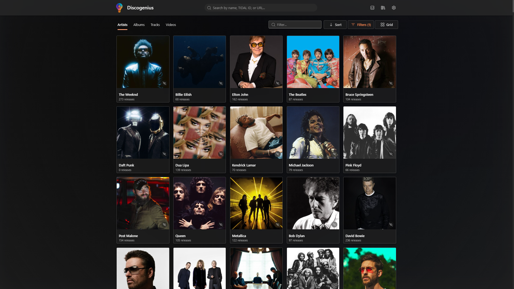
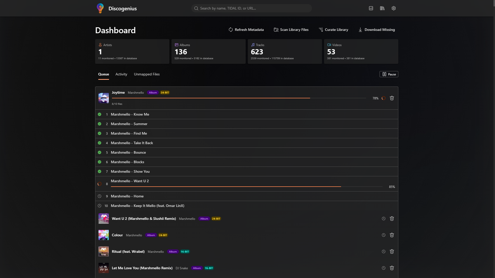
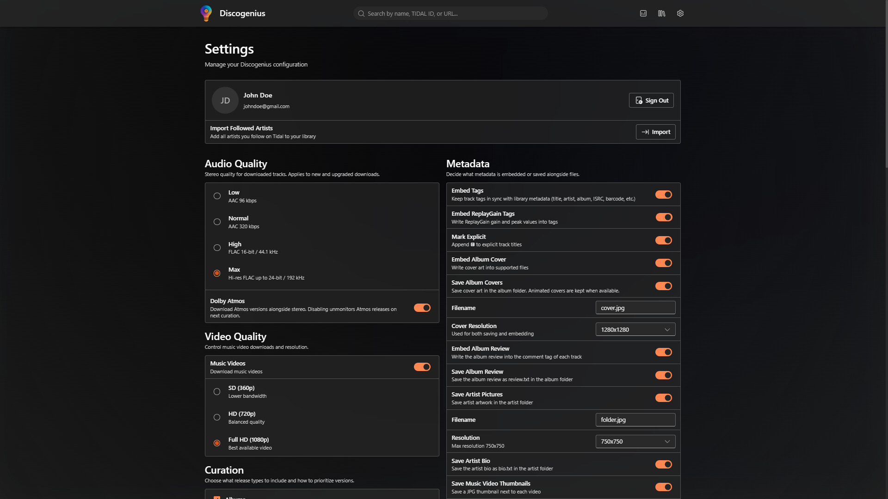

<p align="center">
  
</p>

<h1 align="center">Discogenius</h1>

<p align="center">Discogenius is a self-hosted TIDAL library manager for building and maintaining a local, curated discography.</p>

<p align="center">
  
  
  
  
  
</p>

## Screenshots

<p align="center">
  
</p>

<p align="center">
  
</p>

<p align="center">
  
</p>

## Docker-First Install (Recommended)

Discogenius is distributed as a Docker image. Most users should run it directly from Docker Hub.

Example docker-compose.yml:

```yaml
services:
  discogenius:
    image: rhjanssen/discogenius:latest
    container_name: discogenius
    environment:
      - PUID=1000
      - PGID=1000
      - TZ=Etc/UTC
    ports:
      - 3737:3737
    volumes:
      - /any/path/to/discogenius/config:/config
      - /any/path/to/your/library:/library
    restart: unless-stopped
```

or run with docker directly:

```bash
docker run -d \
  --name discogenius \
  -e PUID=1000 \
  -e PGID=1000 \
  -e TZ=Etc/UTC \
  -p 3737:3737 \
  -v /any/path/to/discogenius/config:/config \
  -v /any/path/to/your/library:/library \
  --restart unless-stopped \
  rhjanssen/discogenius:latest
```

Open the app at http://localhost:3737

`PUID` and `PGID` tell Discogenius which host user should own files created under `/config`. Most NAS setups should set them explicitly. `TZ` controls the container timezone; `Etc/UTC` is the safest default and you can replace it with your local zone if needed. There is no separate runtime volume requirement; downloader runtime state now lives under `/config`.

By default, 3737:3737 publishes on all interfaces (0.0.0.0), which is standard Docker behavior.
If you want localhost-only access, bind explicitly to 127.0.0.1:

```yaml
ports:
  - 127.0.0.1:3737:3737
```

## Updating

Docker upgrades are pull-and-restart. There is no in-container self-updater.

```bash
docker compose pull
docker compose up -d
```

## Local Development (Contributors)

Prerequisites:

- Node.js 20+
- Yarn 1.22.x
- Python 3.12 + `tidal-dl-ng-for-dj` available in a repo-local `.venv`
- Docker (recommended for parity testing)

Install and run both workspaces:

```bash
yarn install
yarn dev
```

Build and lint checks:

```bash
yarn build
yarn lint
```

If you need a source-built container instead of the published image, use the repository `docker-compose.yml` and run:

```bash
docker compose up -d --build
```

## AI-Assisted Code

This project was produced using vibe coding / AI-assisted code generation.

That means:

- Code quality is not guaranteed.
- Features may be incomplete or behave incorrectly.
- Performance may be worse than expected.
- Security and data-safety mistakes may exist.
- AI can make serious mistakes, including subtle logic bugs that are easy to miss.

## Disclaimer

Discogenius is an independent project and is not affiliated with, endorsed by, or associated with TIDAL.

This software is provided for personal use only and requires your own active TIDAL subscription. You are responsible for complying with service terms and applicable copyright/intellectual property laws.

Do not use Discogenius to distribute or pirate music.
